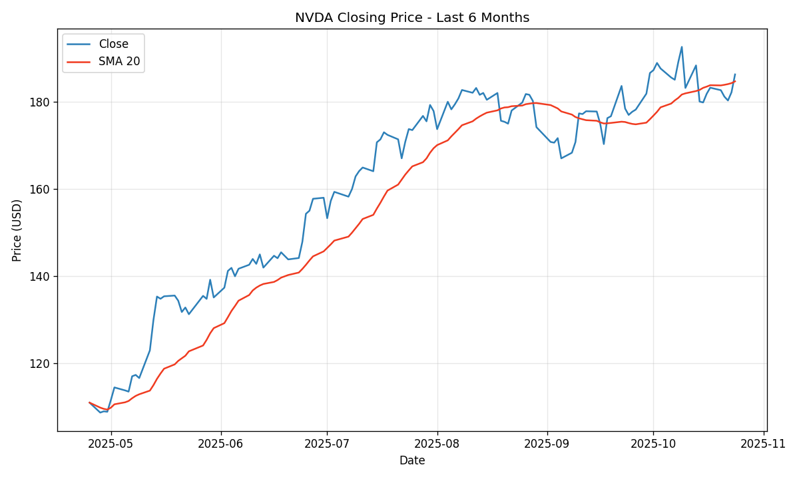

# 📈 NVDA Stock Visualizer

<div align="center">


**A quantitative analysis tool for NVIDIA (NVDA) stock price visualization with technical indicators**

[Features](#-features) • [Installation](#-installation) • [Usage](#-usage) • [Technical Details](#-technical-details) • [Output](#-output)

</div>

---

## 🎯 Overview

This project provides a streamlined Python-based solution for fetching, analyzing, and visualizing NVIDIA stock market data. Built with financial data analysis best practices, it delivers publication-ready charts with technical indicators for informed decision-making.



---

## ✨ Features

| Feature | Description |
|---------|-------------|
| **Real-time Data Fetching** | Pulls live market data via Yahoo Finance API |
| **Technical Indicators** | 20-day Simple Moving Average (SMA) calculation |
| **High-Quality Charts** | Publication-ready visualizations at 120 DPI |
| **Flexible Configuration** | Customizable symbol, period, and interval parameters |
| **Automated Export** | Saves charts as PNG for reports and presentations |

---

## 🛠️ Installation

### Prerequisites
- Python 3.8 or higher
- Internet connection (for market data)

### Setup

```bash
# Clone the repository
git clone https://github.com/yourusername/nvda-stock-visualizer.git
cd nvda-stock-visualizer

# Create virtual environment
python -m venv .venv

# Activate environment
# Windows (PowerShell)
.venv\Scripts\Activate.ps1

# Linux/macOS
source .venv/bin/activate

# Install dependencies
pip install -r requirements.txt
```

### Dependencies
```
yfinance    # Yahoo Finance API wrapper
pandas      # Data manipulation & analysis
matplotlib  # Data visualization
```

---

## 🚀 Usage

### Basic Execution

```bash
python src/plot_nvda.py
```

This will:
1. Download 6 months of NVDA daily price data
2. Calculate 20-day SMA technical indicator
3. Generate and save `nvda_6mo.png`
4. Display interactive chart window

### Programmatic Usage

```python
from src.plot_nvda import main, fetch_price_data, compute_sma

# Default execution
main()

# Custom parameters
main(symbol="NVDA", period="1y", interval="1d", out_file="custom_chart.png")

# Individual components for custom analysis
data = fetch_price_data("NVDA", period="6mo", interval="1d")
sma_20 = compute_sma(data["Close"], window=20)
```

---

## 📊 Technical Details

### Data Pipeline

```
┌─────────────────┐    ┌──────────────────┐    ┌─────────────────┐
│  Yahoo Finance  │───▶│  Data Processing │───▶│  Visualization  │
│   (yfinance)    │    │    (pandas)      │    │  (matplotlib)   │
└─────────────────┘    └──────────────────┘    └─────────────────┘
         │                      │                       │
         ▼                      ▼                       ▼
   OHLCV Data            SMA Calculation         PNG Export
   Acquisition           & Transformation        & Display
```

### Technical Indicators

| Indicator | Calculation | Purpose |
|-----------|-------------|---------|
| **SMA-20** | 20-day rolling mean | Trend identification & support/resistance levels |

### Visualization Specifications

- **Resolution**: 120 DPI (print-quality)
- **Figure Size**: 10×6 inches
- **Color Scheme**: Professional blue (#2c7fb8) for price, red (#f03b20) for SMA
- **Grid**: Enabled with 30% opacity for readability

---

## 📁 Project Structure

```
nvda-stock-visualizer/
├── src/
│   └── plot_nvda.py      # Main visualization module
├── tests/
│   └── test_plot_nvda.py # Unit tests
├── requirements.txt      # Production dependencies
├── requirements-dev.txt  # Development dependencies
├── pyproject.toml        # Project metadata
└── nvda_6mo.png         # Generated chart output
```

---

## 🧪 Development

### Running Tests

```bash
# Install dev dependencies
pip install -r requirements-dev.txt

# Run all tests
pytest

# Run specific test
pytest tests/test_plot_nvda.py::test_compute_sma_basic -v
```

### Code Quality

```bash
# Linting
ruff check .

# Formatting
black .
```

---

## 📈 Output

The visualization includes:

- **Close Price Line**: Daily closing prices over the selected period
- **SMA-20 Line**: 20-day simple moving average overlay
- **Labeled Axes**: Date (x-axis) and Price in USD (y-axis)
- **Legend**: Clear identification of plotted series
- **Grid Lines**: Enhanced readability for price level analysis

---

## 🔧 Configuration Options

| Parameter | Default | Options | Description |
|-----------|---------|---------|-------------|
| `symbol` | `"NVDA"` | Any valid ticker | Stock symbol to analyze |
| `period` | `"6mo"` | 1d, 5d, 1mo, 3mo, 6mo, 1y, 2y, 5y, 10y, ytd, max | Historical data period |
| `interval` | `"1d"` | 1m, 2m, 5m, 15m, 30m, 60m, 90m, 1h, 1d, 5d, 1wk, 1mo, 3mo | Data interval |
| `out_file` | `None` | File path | Custom output path (defaults to `nvda_6mo.png`) |

---

## 📝 Notes

- **Internet Required**: Active connection needed for real-time data fetching
- **Market Hours**: Data reflects market closing prices (after-hours excluded)
- **Headless Environments**: Chart display may require GUI support; PNG export works regardless

---

## 🤝 Contributing

1. Fork the repository
2. Create a feature branch (`git checkout -b feature/enhancement`)
3. Commit changes (`git commit -m 'Add new feature'`)
4. Push to branch (`git push origin feature/enhancement`)
5. Open a Pull Request

---

<div align="center">

**Built with ❤️ for quantitative analysis**

</div>
